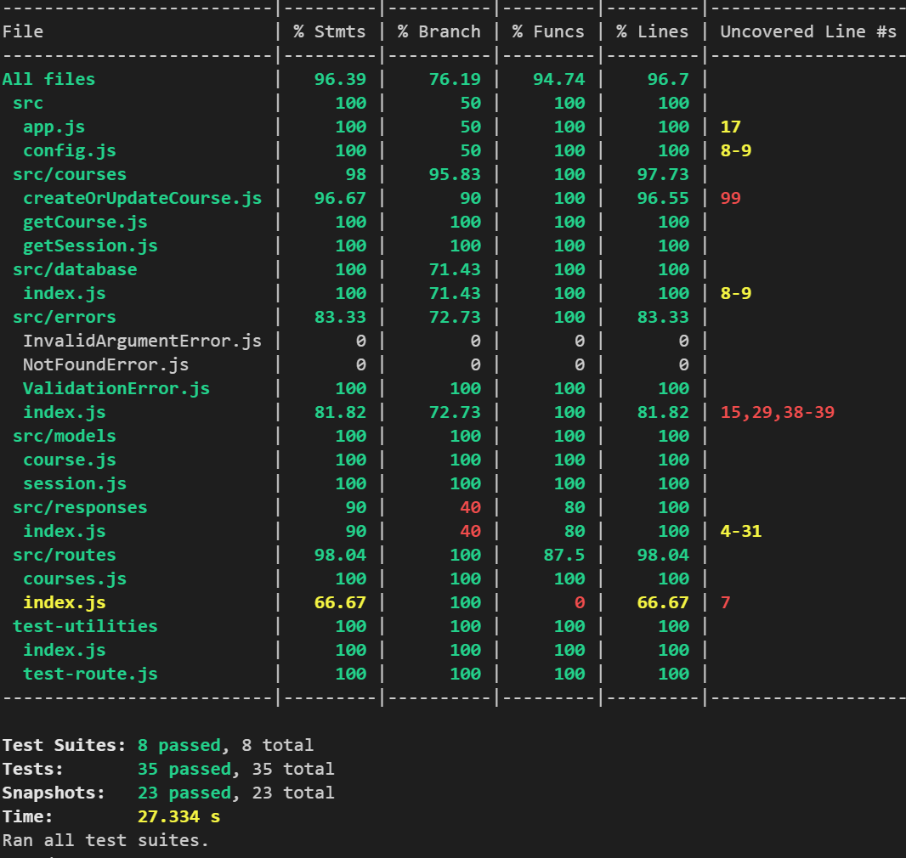

# Stats Service

## Problem

Our learning platform needs to track a **user's stats** for a particular **course**. We do this using a stats service.

The task is to create a simplified version of this service. Your stats service needs to provide the capability to create new stats as well as updating stats. The stats managed by the service are created and updated via HTTP calls. Stats are posted on the completion of a *learning session* and reflect how the *user did* on the learning session.

The service interface it defined in the form of a **swagger**.

## Requirements

- *Stats* are posted based on the **completion of a learning session**.
- Stats can be fetched via an *aggregated call* which **aggregates a users stat history** for a course they are studying.
- Stats should also be fetchable for a **single learning session**.
- The service must be easily **runnable/startable** & **deployable** on the
  *AWS* *ecosystem* by the reviewer of the task. Other than node.js being the main language, any technology can be
  used.
- The project should be submitted in the form of a **code repository**.
- Please state any assumptions or deviations from the specification in the repository readme.
- Stats should be persisted using a **database** of your choosing
- Your service should have some level of **tests**

## A little elaboration of the terminology we use to garner a bit more context:

**Course** - refers to a course on a particular subject that a user is learning. A course is made up of learning sessions

**Session** - refers to a learning session that a user studies. Sessions are made up of modules that display content

**Modules** - display content to the user. There are *15 module types* and these are
used depending on the type of content that is being displayed

# Environment

Basic instructions to start build and get this API up and running

| package command      | description                                                  |
| :------------------- | :----------------------------------------------------------- |
| `npm i`              | **Install** all the packages                                 |
| `npm start`          | Runs and builds the application with **production** configuration |
| `npm run start:dev`  | Runs and builds the application with **development** configuration |
| `npm run watch:dev`  | Runs **dev** with ability to rebuild the application when any files change |
| `npm run build`      | **Builds the project**, cleaning the project, transpiling it and then cleaning the *transpiled* tests |
| `npm run test`       | Runs all the **tests once**                                  |
| `npm run test:watch` | Runs test in **test-development** mode while the developer creates tests giving the ability to automatically run when changes made |
| `npm run coverage`   | Runs all the tests to calculate the test coverage and to vet if it succeeds against the expected size |

## Architecture

- **Node Express API** solution using Mongoose to connect to *MongoDb* either a temporary or a real mongo database. By default this is configured to work with data in the temp data storage.


- **Architecture diagram** is included in code as a [C4 model](https://c4model.com/) Container Diagram of the proposed system done using [PUML](https://github.com/vfarah-if/C4-PlantUML#advanced-samples) within the project, so the architecture diagrams can live in the context of the code base and become living documentation that wont be lost in some Wiki, but with the code that this communicates

- *Testing the API manually* can be done through either the **Swagger UI** which I embedded in the application using the Swagger library and simply added the swagger.xml sent as part of the code exercise. Personally I used ***Postman*** to test the API making it easier to repeat manually testing stuff until I had tests in place

  

- Database model consists of two structures, **course** and **session**. When you post the first course with some session information this will generate some aggregated stats on the session data that is passed in for the course. The course data model has various data and validators built in to make sure the data is in the expected format, built into the model. **NOTE:**  I introduce ***SessionCount*** into the structure to help me understand some of the data I was aggregating. It make it easier, in my opinion to obviously see the generated data and what I was aggregating the data on

  ```javascript
  const courseSchema = new mongoose.Schema({
    courseId: {
      type: String,
      required: true,
      unique: false,
      lowercase: false,
      validate: (value) => validator.isUUID(value),
    },
    userId: {
      type: String,
      required: true,
      unique: false,
      lowercase: false,
      validate: (value) => validator.isUUID(value),
    },
    stats: {
      sessionCount: { type: Number, required: true },
      averageScore: { type: Number, required: true },
      totalModulesStudied: { type: Number, required: true },
      timeStudied: { type: Number, required: true },
    },
  });
  courseSchema.index({ courseId: 1, userId: 1 }, { unique: true });
  
  export default mongoose.model("course", courseSchema);
  ```

  The  session data has a **composite index** on *sessionId*, courseId and userId making sure duplicates can not be added and also optimising retrieval of data by each of those values

  ```javascript
  const sessionSchema = new mongoose.Schema({
    sessionId: {
      type: String,
      required: true,
      unique: true,
      lowercase: false,
      validate: (value) => validator.isUUID(value),
    },
    courseId: {
      type: String,
      required: true,
      unique: false,
      lowercase: false,
      validate: (value) => validator.isUUID(value),
    },
    userId: {
      type: String,
      required: true,
      unique: false,
      lowercase: false,
      validate: (value) => validator.isUUID(value),
    },
    stats:{
      averageScore: { type: Number, required: true },
      totalModulesStudied: { type: Number, required: true },
      timeStudied: { type: Number, required: true },
    }
  });
  sessionSchema.index({ sessionId: 1, courseId: 1, userId: 1 }, { unique: true });
  
  export default mongoose.model("session", sessionSchema);
  
  ```

- The databases documents that get generated automatically create **indexes** and **optimise** the efficiency of how this stored for reading and writing and verifying the integrity of the data

  

- Toggling between an *in-memory* database and a *durable* database can be done by configuring the **server.js** file if you want to see the values generated in a visible database, but for the ease of deployment and running this without configuring a docker file or cloudformation script to prepare a *MongoDB environment*. This could simplify things and guarantee this will work. At the same time it also made testing database integration very easy, which is why I wanted an excuse to use this library and implementation.

  ```javascript
  async function connectMongoDb() {
    // REMARKS: Change the true to false if you want to connect to a durable database
    const result = await connectDatabase(false);
    return result;
  }
  ```
  
- The **4 rules of Simple Design**, by Kent Beck states:

  - Tests Pass
  - Express Intent
  - No Duplication (Logical ideas)
  - KISS

- Elaborating on what *Kent* stated above as key values for a good design, and valuing my solution by each premise, I added tests to almost every part of the application. Most of them utilised the test framework or temp database so mimicked an integration test more than a unit test. Usually I mock all this using Jest mock frameworks, but the actual temp database provider really made it easy for me to generate a lot without needing to mock anything. The advantage is I could develop database stuff quickly using a the "real" database and control the state of the database. The disadvantage is it is probably slower than mocking and can have an impact on time taken with a big database. The honest truth is for 29 tests they were all under a second each so on a slow system it took 20 seconds to run all the tests, which I can live with as my dev machine is not the fastest. However production wise it makes more sense to adhere to a test pyramid more strictly, unit tests the biggest, integration second and e2e the smallest being the most expensive to run

  

- The code structure is simple, the business domain exposes function that reflect services by the domain. The *course* is the domain term used in the original requirement. The infrastructure layer is named database and is implemented within the domain layer as an internal object, so this could be replaced with another infrastructure as the web API calls the courses service without understanding the internals of the infrastructure. Everything within src is **transpiled** to a *dist-server* folder where this is run locally using Node. Everything outside of *src* is more to do with configuration and tests. So using DDD and Hexagonal Architecture helps with layering various bits, which is simplified within a Node structure

- I added my .env file to source just for simplicity but usually the target builds should stich this by environment variables and builds

- The entire API is driven by environment variables to make this easy when this is deployed to AWS so *APIGateway* can utilise lambdas and environment variables configured and passed to the ***serverless.yaml*** file

- Never mutate data and try use composable pure functions where possible

- The paths and environments are outputted when the application is starting up with debug outputs and general output that helps developers quickly understand information that Express Endpoints output. Communicating as much of the environment is the best way to get newbs familiar with what this API does

  

- The API has a static page that can be enhanced to add wiki like documentation on the usage of the API and any other information that may help people consuming this API. Communication is fundamental at all levels

  

  # Summary
  
  *Mongoose* was new to me, as well as *SuperTest* and doing Node as an ES6+ application, usually convert to Typescript or leave Node as a default Node App and was pleasantly surprised on how nice all of the libraries where to put a Node application together. Working with React and Next JS CLI frameworks help with generating a lot of this manual plumbing we take for granted. Creating my own template  took a little time and helped me to reuse some concepts for next time I need to play with express and node from a simplistic template generated. Having finished this I can already see other better templates I could have based it on but there will always be something better.