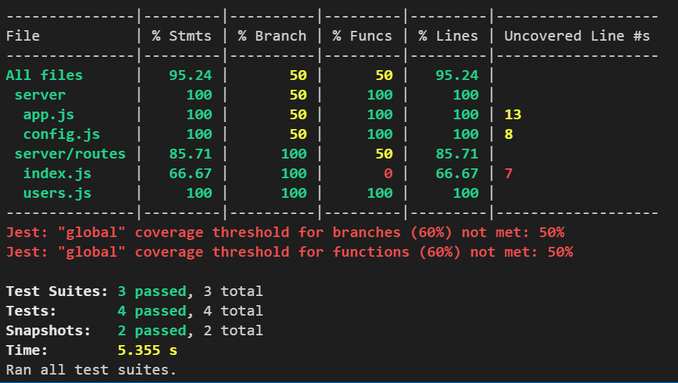
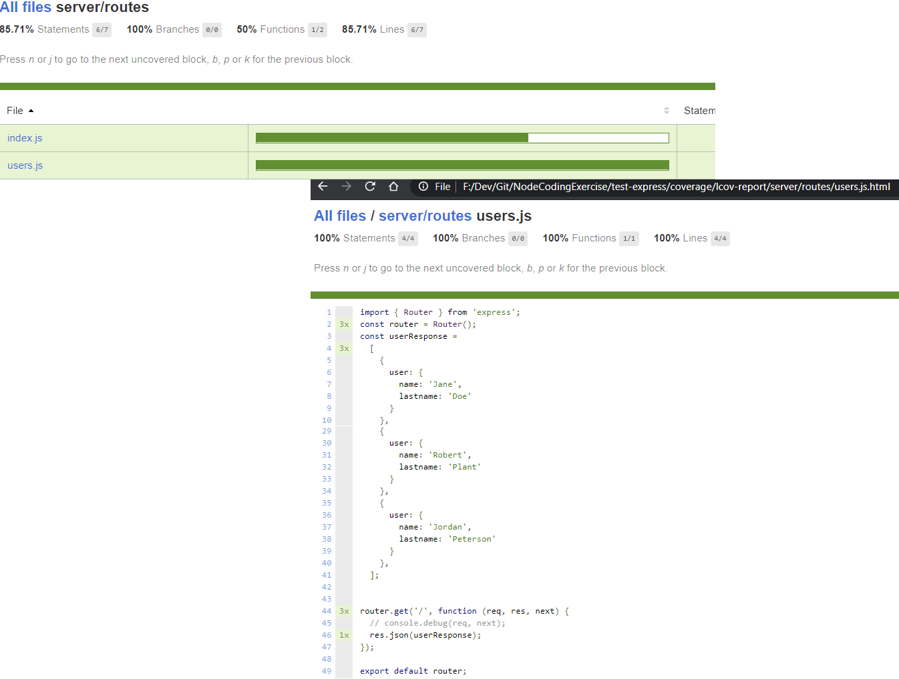
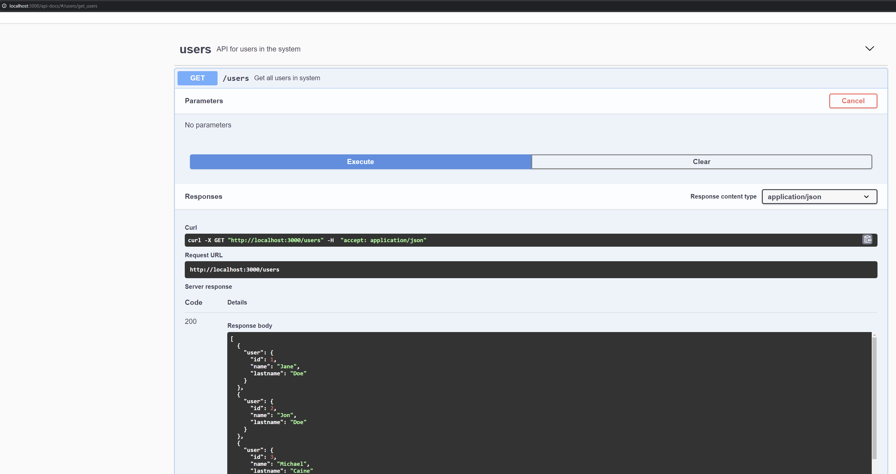
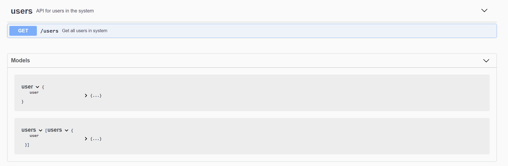

# Environment

Basic instructions to start build and get this API up and running

| package command      | description                                                                                                                        |
| :------------------- | :--------------------------------------------------------------------------------------------------------------------------------- |
| `npm i`              | **Install** all the packages                                                                                                       |
| `npm start`          | Runs and builds the application with **production** configuration                                                                  |
| `npm run start:dev`  | Runs and builds the application with **development** configuration                                                                 |
| `npm run watch:dev`  | Runs **dev** with ability to rebuild the application when any files change                                                         |
| `npm run build`      | **Builds the project**, cleaning the project, transpiling it and then cleaning the _transpiled_ tests                              |
| `npm run test`       | Runs all the **tests once**                                                                                                        |
| `npm run test:watch` | Runs test in **test-development** mode while the developer creates tests giving the ability to automatically run when changes made |

# Introduction

This is a skeleton Node Application generated basically for testing [Express API](https://expressjs.com/en/api.html) ideas. Do you find plumbing work usually gets done over and over again?This will be good for coding exercises and other types of base Express Ideas but also allowing myself time to focus on the business problem in an ideal environment. Tried to incorporate some testing ideas that can make testing easier and succeeded with a new framework, details below, or something new I can incorporate into my learning process and the bonus is I can generate express applications rapidly now with all the expected plumbing I need.

Finally [Clean Architecture Principles](https://medium.com/@danielkao/summary-of-clean-architecture-i-910d1ebdc60b) should be the basis for all development going forward.

This document is to help map out some of my thoughts when I generated this and hopefully it wont go out of date too soon.

## Template Generation Steps

1. I generated a base express application using `npx express-generator your-project-name --no-view`

2. Generating an express application using [ES6+](https://www.greycampus.com/blog/programming/java-script-versions) can be done very easily [following these instructions using babel](https://www.freecodecamp.org/news/how-to-enable-es6-and-beyond-syntax-with-node-and-express-68d3e11fe1ab/)

   `npx express-generator your-project-name --no-view`

   `Refactor some of the generated code into src folder`

   `Start removing the require to imports out of all units under generated folder`

   `npm install --save npm-run-all`

   `npm install --save @babel/core @babel/cli @babel/preset-env nodemon rimraf`

   Configure babel _package json_

   ```json
   // package.json
   {
     // ... contents above
     "babel": {
       "presets": ["@babel/preset-env"]
     }
   }
   ```

   Configure scripts to _transpile_

   ```json
   // package.json
   "scripts": {
       "start": "node ./src/bin/server",
       "transpile": "babel ./server --out-dir dist-server"
   }

   ```

   Finally run `npm run transpile`

   ```json
   // package.json
   "build": "npm-run-all clean transpile"
   ```

   **NOTE:** Installed `npm install --save-dev cross-env` for any environment settings, only needed for windows

3. Automatically recompiling code when changes are made using [nodemon](https://github.com/remy/nodemon)

   ```json
   // package.json
   ...
   "nodemonConfig": {
     "exec": "npm run dev",
     "watch": ["src/*", "public/*"],
     "ignore": ["**/__tests__/**", "*.test.js", "*.spec.js"]
   },
   "scripts": {
     // ... other scripts
     "watch:dev": "nodemon"
   }
   ```

4. Configuring _Jest Tests_ to run once or to watch while you develop the tests

   ```json
   // package.json
   ...
   "jest": {
     "testEnvironment": "node"
   },
   "scripts": {
     // ... other scripts
     "test": "jest",
     "test:watch": "jest --watch"
   }
   ```

5. **Jest documentation** can be found [here](https://jestjs.io/docs/en/getting-started)

6. Struggled with Jest Test _VSCode_ code completion and so decided to install the Typescript Types to help improve matters. On doing so nothing improved. Then googled and found adding _jsconfig.json_ with this value improved things massively

   ```json
   // jsconfig.json
   { "typeAcquisition": { "include": ["jest"] } }
   ```

7. Tried endpoint testing based on a new framework, [supertest](https://zellwk.com/blog/endpoint-testing/), to try something new and was pleasantly surprised at how easy this to use. That mixed with Jest snapshots, easy to generate simple [characterisation test](https://en.wikipedia.org/wiki/Characterization_test) and then make sure the edge cases and underlying libraries are nicely unit tested. Kept it simple for the moment, a production setup would need a lot more thought but this should give you a good taste for it and the rest is up to your imagination

   

8. Programmers without things [TODO](https://github.com/fabiospampinato/vscode-todo-plus), become aimless and goalless, which is why TDD is good, helps to focus what needs to be done. Busy existence means we cant get everything done, so it makes sense to prioritise and state what has been done and what needs to be done with a priority order. You can then lift and shift this into a Jira ticket as a _dev tasks list_ to help communicate thoughts and intentions in resolving any outstanding tasks. The art of software engineering is about **communication** and breaking problems up into little easy to conquer problems. Install within _VSCode_ the TODO extension and you can learn the shortcuts [here](https://github.com/fabiospampinato/vscode-todo-plus/blob/master/resources/readme.todo)

   

9. **Environment setting** are defined using [.env](https://medium.com/the-node-js-collection/making-your-node-js-work-everywhere-with-environment-variables-2da8cdf6e786) for setting up a configuration in the root of the project to work with environment variables, which in turn can be setup to receive variables and settings from deployment pipelines

10. Configured **code coverage** to make the coverage visual, and to report any violations below a configured standard of coverage set for test scenario

    

11. HTML outputs get generated for all types of coverage reports required to analyse the code examples e.g. the **lcov report** below.

    

12. Investigated a simple option of outputting a **express endpoints** using an express library called [expressListendpoints](https://github.com/AlbertoFdzM/express-list-endpoints)

13. Added **Swagger** to the project using a really good [blog](https://medium.com/@kirtikau/how-to-add-swagger-ui-to-existing-node-js-and-express-js-project-2c8bad9364ce) using UI express which helped me to express a really simple scenario as in the image below. This was very useful in allowing me to test my endpoints quickly using a ui as well as documenting my assumptions. This can be misleading if the swagger is incorrectly formatted but is a great way to confirm any documents assigned

    

    Below is a summary of the API's formatted to expose models and the executor you can see above.

    
