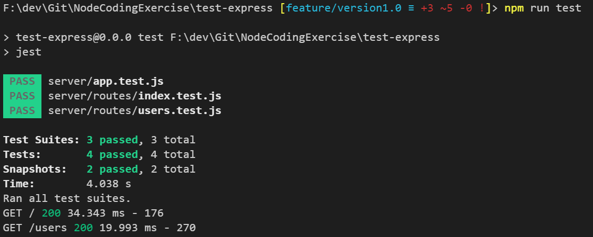
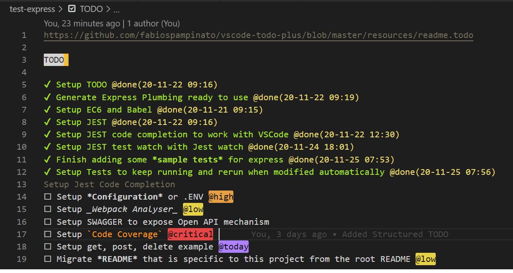

# Introduction

This is a skeleton Node Application generated basically for testing express API ideas. Do you find plumbing work usually gets done over and over again?This will be good for coding exercises and other types of base Express Ideas but also allowing myself time to focus on the business problem in an ideal environment. Tried to incorporate some testing ideas that can make testing easier and succeeded with a new framework, details below,  or something new I can incorporate into my learning process and the bonus is I can generate express applications rapidly now with all the expected plumbing I need. 

Finally [clean architecture principles](https://medium.com/@danielkao/summary-of-clean-architecture-i-910d1ebdc60b) should be the basis for all development going forward.

This document is to help map out some of my thoughts when I generated this and hopefully it wont go out of date too soon.

## Template Generation Steps

1. I generated a base express application using `npx express-generator your-project-name --no-view`

2. Generating an express application with ES6 can be done very easily [following these instructions using babel](https://www.freecodecamp.org/news/how-to-enable-es6-and-beyond-syntax-with-node-and-express-68d3e11fe1ab/)

   `npx express-generator your-project-name --no-view`

   `Refactor some of the generated code into server folder`

   `Start removing the require to imports out of all units under generated folder`

   `npm install --save npm-run-all`

   `npm install --save @babel/core @babel/cli @babel/preset-env nodemon rimraf`

   Configure babel _package json_

   ```json
   // package.json
   {
     // ... contents above
     "babel": {
       "presets": ["@babel/preset-env"]
     }
   }
   ```

   Configure scripts to _transpile_

   ```json
   // package.json
   "scripts": {
       "start": "node ./server/bin/www",
       "transpile": "babel ./server --out-dir dist-server"
   }

   ```

   Finally run `npm run transpile`

   ```json
   // package.json
   "build": "npm-run-all clean transpile"
   ```

   **NOTE:** Installed `npm install --save-dev cross-env` for any environment settings, only needed for windows

3. Automatically recompiling code when changes are made

   ```json
   // package.json
   ...
   "nodemonConfig": {
     "exec": "npm run dev",
     "watch": ["server/*", "public/*"],
     "ignore": ["**/__tests__/**", "*.test.js", "*.spec.js"]
   },
   "scripts": {
     // ... other scripts
     "watch:dev": "nodemon"
   }
   ```

4. Configuring _Jest Tests_ to run once or to watch while you develop the tests

   ```json
   // package.json
   ...
   "jest": {
     "testEnvironment": "node"
   },
   "scripts": {
     // ... other scripts
     "test": "jest",
     "test:watch": "jest --watch"
   }
   ```

5. **Jest documentation** can be found [here](https://jestjs.io/docs/en/getting-started)

6. Struggled with Jest Test *VSCode* code completion and so decided to install the Typescript Types to help improve matters. On doing so nothing improved. Then googled and found adding *jsconfig.json* with this value improved things massively

   ```json
   // jsconfig.json
   { "typeAcquisition": { "include": ["jest"] } }
   ```

7. Tried endpoint testing based on a new framework, [supertest](https://zellwk.com/blog/endpoint-testing/), to try something new and was pleasantly surprised at how easy this to use. That mixed with Jest snapshots, easy to generate simple [characterisation test](https://en.wikipedia.org/wiki/Characterization_test) and then make sure the edge cases and underlying libraries are nicely unit tested.  Kept it simple for the moment, a production setup would need a lot more thought but this give you a good taste for it and the rest is up to your imagination

   

8. Programmers without things [TODO](https://github.com/fabiospampinato/vscode-todo-plus), become aimless and goalless, which is why TDD is good, helps to focus what needs to be done. Busy existance means we cant get everything done, so it makes sense to prioritise and state what has been done and what needs to be done with a priority order. You can then lift and shift this into a Jira ticket as a *dev tasks list* to help communicate thoughts and intentions in resolving any outstanding tasks. The art of software engineering is about **communication** and breaking problems up into little easy to conquer problems. Install within *VScode* the TODO extension and you can learn the shortcuts [here](https://github.com/fabiospampinato/vscode-todo-plus/blob/master/resources/readme.todo)

   

